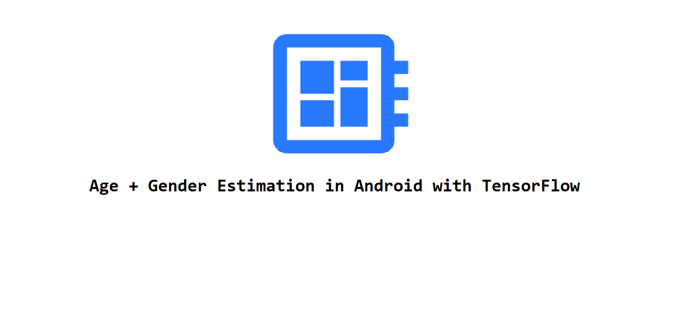
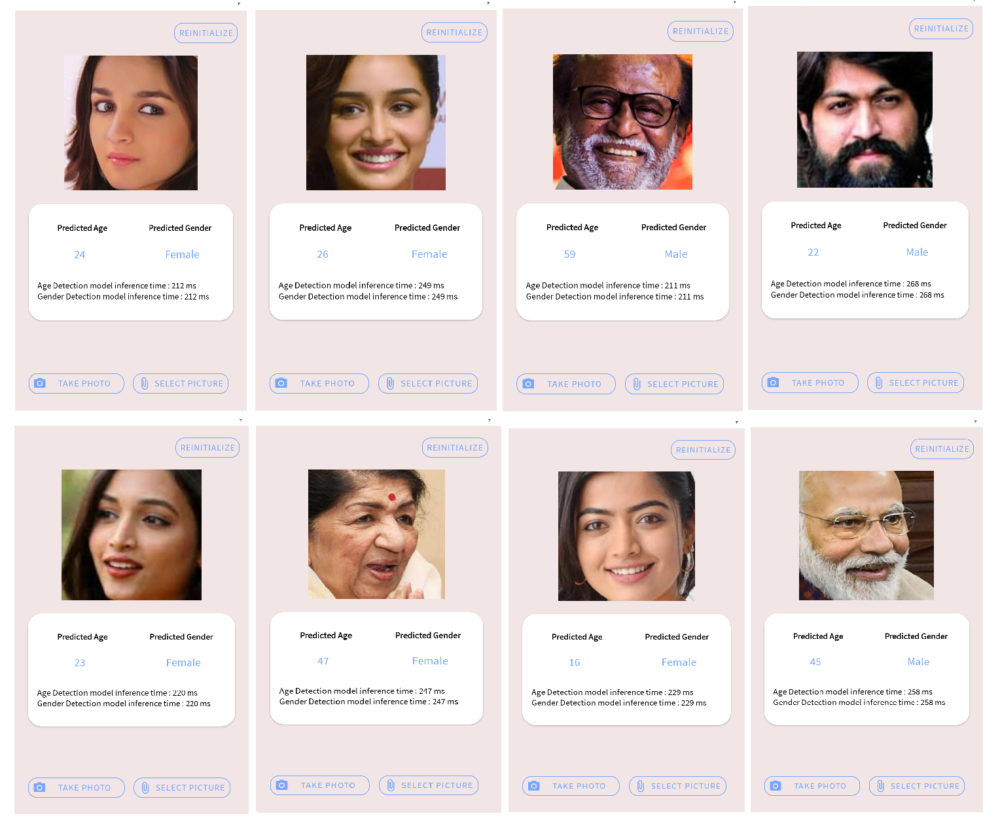
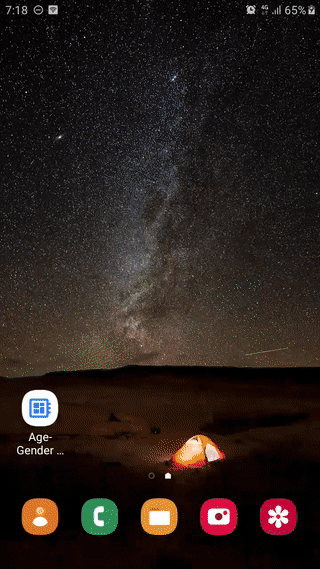

<div align="center">
  <h1>Age + Gender Estimation in Android with TensorFlow</h1>
</div>



---

### **Contents**

*[**Python project**](https://github.com/shubham0204/Age-Gender_Estimation_TF-Android#%EF%B8%8F-python-project)*

* [Google Colab Notebooks](https://github.com/shubham0204/Age-Gender_Estimation_TF-Android#-colab-notebooks)
* [Dataset](https://github.com/shubham0204/Age-Gender_Estimation_TF-Android#-dataset)
* [Model ( *Vanilla* vs. Lite )](https://github.com/shubham0204/Age-Gender_Estimation_TF-Android#-model)

*[**Android project**](https://github.com/shubham0204/Age-Gender_Estimation_TF-Android#-android-project)*

 * [Overview](https://github.com/shubham0204/Age-Gender_Estimation_TF-Android#-overview)
 * [Usage](https://github.com/shubham0204/Age-Gender_Estimation_TF-Android#-usage)
 * [Project Configuration ( + Firebase Services )](https://github.com/shubham0204/Age-Gender_Estimation_TF-Android#-project-configuration)
 * [TensorFlow Lite models](https://github.com/shubham0204/Age-Gender_Estimation_TF-Android#-tensorflow-lite-models)
 * [NNAPI and `GpuDelegate` compatibility](https://github.com/shubham0204/Age-Gender_Estimation_TF-Android#-nnapi-and-gpudelegate-compatibility)

*[Issues and Suggestions](https://github.com/shubham0204/Age-Gender_Estimation_TF-Android#-issues-and-suggestions)*

*[License](https://github.com/shubham0204/Age-Gender_Estimation_TF-Android#%EF%B8%8F-license)*

>  I'm open for **freelancing** in Android + ML projects. You may send me an email at **equipintelligence@gmail.com**.

---



---


## 🖥️ Python Project

### 👉🏻 Colab Notebooks

As the application uses two different models for age and gender estimation, we provide two notebooks to train the age and gender detection models. These are Google Colab notebooks and are capable of downloading the dataset, training the model, and finally exporting the TFLite model ( used in the Android app ).

* [`Age Estimation in TensorFlow - Google Colab`](https://github.com/shubham0204/Google_Colab_Notebooks/blob/main/Age_Estimation_(W1).ipynb)

[](https://colab.research.google.com/github/shubham0204/Google_Colab_Notebooks/blob/main/Age_Estimation_(W1).ipynb)

* [`Gender Classification in TensorFlow - Google Colab`](https://github.com/shubham0204/Google_Colab_Notebooks/blob/main/Gender_Estimation_(W2).ipynb)

[](https://colab.research.google.com/github/shubham0204/Google_Colab_Notebooks/blob/main/Gender_Estimation_(W2).ipynb)

> The notebooks describe each step in the implementation and are self explanatory. For any questions/issues/suggestions regarding the notebooks, see *[Issues and Suggestions](https://github.com/shubham0204/Age-Gender_Estimation_TF-Android#-issues-and-suggestions)*

The Keras models ( `.h5` ) are available here,

* [`Keras models for age and gender estimation`](https://drive.google.com/drive/folders/13478oTfOHD9Fkf53FtLXQEXO_IlgIPP5?usp=sharing)


### 👉🏻 Dataset

The TensorFlow models are trained on the [UTKFace dataset](https://susanqq.github.io/UTKFace/)  which contains 23K images with age, gender and ethnicity annotations. We use 20K samples from the dataset, in which 14K images are used for training and 6K images are used to evaluate the model.

For both the models, we use 3-channeled RGB images as inputs. The age estimation model takes in `200 * 200` images as inputs whereas the gender classification model takes in images of size `128 * 128`.

* For the age estimation model, we normalize the target variable i.e the age of the person. Hence the model's output is in the range `( 0 , 1 ]`. The predicted age is obtained by multiplying the model's output with a suitable factor ( which in our case is `116` ).
* For gender classification, the model outputs a probability distribution for the two labels `male` and `female` .

### 👉🏻 Model

We provide two different variants of our models. We refer these variants as `vanilla` and `lite`.  **The `lite` models are identical to the `vanilla` models except that they use separable convolutions instead of the standard convolutions.** You'll notice the change in the Colab notebook,

```
# Define the conv block.
if lite_model:
        x = tf.keras.layers.SeparableConv2D( num_filters ,
                                            kernel_size=kernel_size ,
                                            strides=strides 
                                            , use_bias=False ,
                                            kernel_initializer=tf.keras.initializers.HeNormal() ,
                                            kernel_regularizer=tf.keras.regularizers.L2( 1e-5 )
                                             )( x )
 else:
        x = tf.keras.layers.Conv2D( num_filters ,
                                   kernel_size=kernel_size ,
                                   strides=strides ,
                                   use_bias=False ,
                                   kernel_initializer=tf.keras.initializers.HeNormal() ,
                                   kernel_regularizer=tf.keras.regularizers.L2( 1e-5 )
                                    )( x )
 
    x = tf.keras.layers.BatchNormalization()( x )
    x = tf.keras.layers.LeakyReLU( leaky_relu_alpha )( x )
```

Separable Convolutions have lesser parameters than standard convolutions, and hence reduce the size of our model. Also, the `lite` models run faster as compared to their `vanilla` counterparts. The increase in speed is companioned with a slight decrease in the performance of the model as shown below,

| Model ( Age Estimation ) | `vanilla` model | `lite` model | 
|--|:--:| :--: |
| No. of parameters| 1,069,297 | 200,956 |
| MAE | `2.425` | `4.586` |


| Model ( Gender Classification ) | `vanilla` model | `lite` model | 
|--|:--:| :--: |
| No. of parameters | 675,090 | 328,733 |
| Accuracy ( % ) | `99.8` | `96.4` |

---

## 📱 Android Project

### 👉🏻 Overview

The following GIF displays the basic functionality of the app. You may observe the four options provided for "Choose Model" and also the NNAPI and GPU Delegate options. The inference time may change depending on the device you're using.

 

### 👉🏻 Usage

* Open the app. A dialog box saying "Initialize a Model" pops up. Select any one of the four models.
* Select the additional options, like "Use NNAPI" and "Use GPU". If any of these options are not available on your device, a message will be shown for the same. See [NNAPI and `GpuDelegate` compatibility](#nnapi-and-gpudelegate-compatibility)
* Once the models are initialized, tap "Take Photo" to open the default camera app.
* If none of the faces are identified in the picture, a dialog will be displayed, prompting you to take another picture. If everything goes fine, the results appear on the screen in a couple of seconds.
* Tap "Reinitialize" to try another model provided in the app.

> **Note: If the picture clicked by the user contains multiple faces, results will be shown for a single face only. This is a drawback and we'll try to improve it in the next releases.**

### 👉🏻 Project Configuration

The project has been configured with the below settings, which can be easily found in the app's `build.gradle` file.
```
// SDK Info
compileSdkVersion 30  
buildToolsVersion "30.0.0"  

// App info
applicationId "com.ml.projects.age_genderdetection"  
minSdkVersion 23  
targetSdkVersion 30  

// Version info
versionCode 1  
versionName "1.0"
```

The versions of the Android Gradle plugin and the Gradle Version are mentioned below.

```
Android Gradle Plugin Version: 4.1.3
Gradle Version: 6.5
```

As mentioned, the project utilizes Firebase, and specifically [MLKit FaceDetector](https://firebase.google.com/docs/ml-kit/detect-faces). To connect the app with Firebase, follow these [instructions](https://firebase.google.com/docs/android/setup#register-app). Download the `google-services.json` file and place it in the `app` folder. The Firebase library required for the face detection functionality is added in the app's `build.gradle`,

```
implementation 'com.google.android.gms:play-services-mlkit-face-detection:16.1.5'
```

> Why isn't the `google-services.json` file shared alongside the code in this repo?
> That's because the file contains credentials unique for every user. ( You may need to create a Firebase project. Follow the instructions cited above )

###  👉🏻 TensorFlow Lite models

To enable TFLite capabilities in our Android project, we add the below libraries to our project,

```
implementation 'org.tensorflow:tensorflow-lite:2.4.0'  
implementation 'org.tensorflow:tensorflow-lite-gpu:2.4.0'  
implementation 'org.tensorflow:tensorflow-lite-support:0.1.0'
```
> See the [packages on JFrog Bintray](https://bintray.com/google/tensorflow).

All TFLite models are placed in the app's `assets` folder. In order to disable the compression performed on files present in the `assets` folder, we add the following flag in app's `build.gradle` ,

```
android {  
  ...
  aaptOptions {  
     noCompress "tflite"  
  }
  ...
}  
```
The names of these models are stored in the `modelFilenames` array in `MainActivity.kt`,

```
private val modelFilenames = arrayOf(  
    arrayOf("model_age_q.tflite", "model_gender_q.tflite"),  
    arrayOf("model_age_nonq.tflite", "model_gender_nonq.tflite"),  
    arrayOf("model_lite_age_q.tflite", "model_lite_gender_q.tflite"),  
    arrayOf("model_lite_age_nonq.tflite", "model_lite_gender_nonq.tflite"),  
)
```
Whenever the user selects a particular model, we use the `FileUtil.loadMappedFile()` method to get `MappedByteBuffer` of the model, which is then passed to the constructor of  `Interpreter`,

```
ageModelInterpreter = Interpreter(FileUtil.loadMappedFile( applicationContext , "model_v6_age_q.tflite"), options )
```
> Note: The method `FileUtil.loadMappedBuffer()` comes from the `tf-lite-support` library, which helps us parse TFLite models and also to preprocess model inputs.

### 👉🏻 NNAPI and `GpuDelegate` compatibility

The app offers acceleration through the means of NNAPI and `GpuDelegate` provided by TensorFlow Lite.

* [TensorFlow Lite NNAPI delegate](nsorflow.org/lite/performance/nnapi)
* [TensorFlow Lite GPU delegate](https://www.tensorflow.org/lite/performance/gpu)

As mentioned in the docs, NNAPI is compatible for Android devices running Android Pie ( API level 27 ) and above. The app checks this compatibility in `MainActivity.kt`,

```
if ( Build.VERSION.SDK_INT < Build.VERSION_CODES.P ) {  
    useNNApiCheckBox.isEnabled = false  
    useNNApiCheckBox.text = "Use NNAPI ( Not available as your Android version is less than 9 ( Android Pie )."  
    useNNApi = false  
}
```

The `GpuDelegate` also performs the following compatibility check,

```
if ( !compatList.isDelegateSupportedOnThisDevice ){  
    useGPUCheckBox.isEnabled = false  
    useGPUCheckBox.text = "Use GPU ( GPU acceleration is not available on this device )."  
    useGpu = false  
}
```

## 🔧 Issues and Suggestions

If any issue occurs, you may [open an issue]() or [start a new discussion](). Please mention the following while addressing your issue,

* The name of the device you're using ( along with its Android version ).
* Crash logs if you think they might be helpful.
* If you've found something related to the issue elsewhere, mention them as well so that the issue could be resolved as fast as possible.


## 👨🏻‍✈️ License

```
MIT License  
  
Copyright (c) 2021 Shubham Panchal  
  
Permission is hereby granted, free of charge, to any person obtaining a copy  
of this software and associated documentation files (the "Software"), to deal  
in the Software without restriction, including without limitation the rights  
to use, copy, modify, merge, publish, distribute, sublicense, and/or sell  
copies of the Software, and to permit persons to whom the Software is  
furnished to do so, subject to the following conditions:  
  
The above copyright notice and this permission notice shall be included in all  
copies or substantial portions of the Software.  
  
THE SOFTWARE IS PROVIDED "AS IS", WITHOUT WARRANTY OF ANY KIND, EXPRESS OR  
IMPLIED, INCLUDING BUT NOT LIMITED TO THE WARRANTIES OF MERCHANTABILITY,  
FITNESS FOR A PARTICULAR PURPOSE AND NONINFRINGEMENT. IN NO EVENT SHALL THE  
AUTHORS OR COPYRIGHT HOLDERS BE LIABLE FOR ANY CLAIM, DAMAGES OR OTHER  
LIABILITY, WHETHER IN AN ACTION OF CONTRACT, TORT OR OTHERWISE, ARISING FROM,  
OUT OF OR IN CONNECTION WITH THE SOFTWARE OR THE USE OR OTHER DEALINGS IN THE  
SOFTWARE.
```
